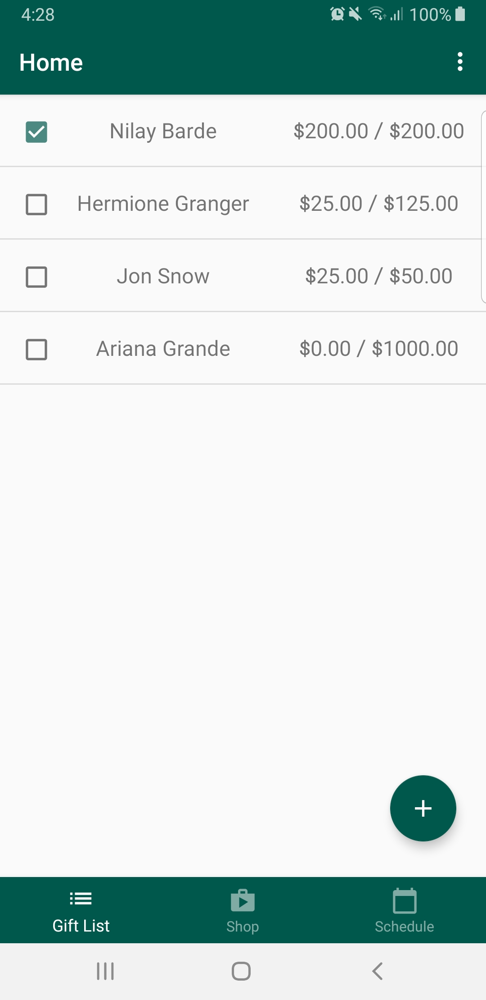
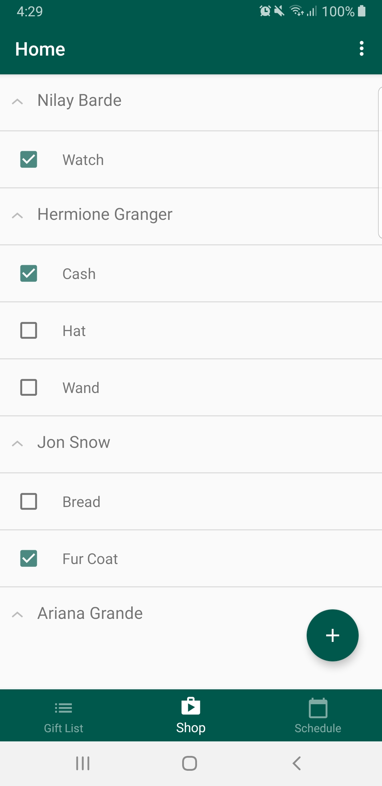
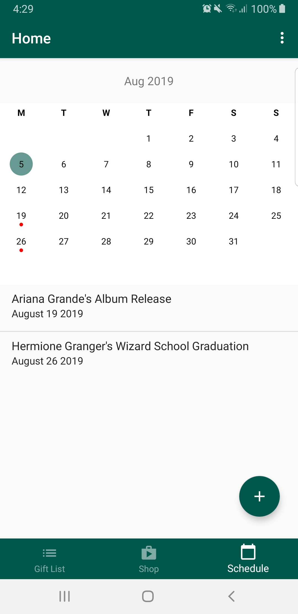
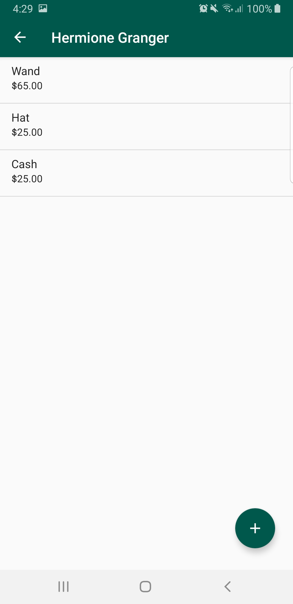
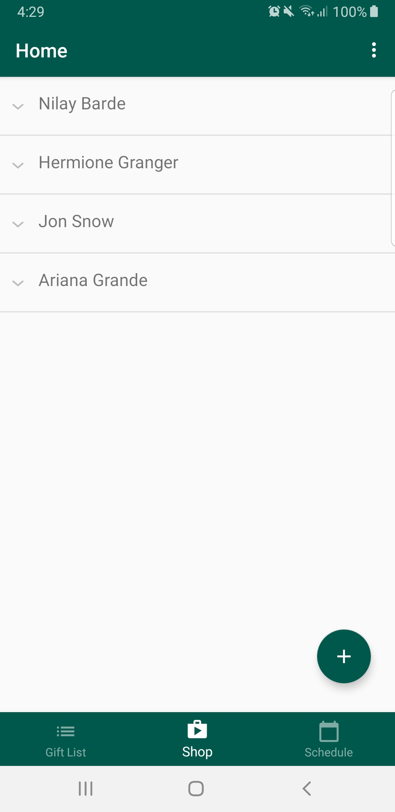
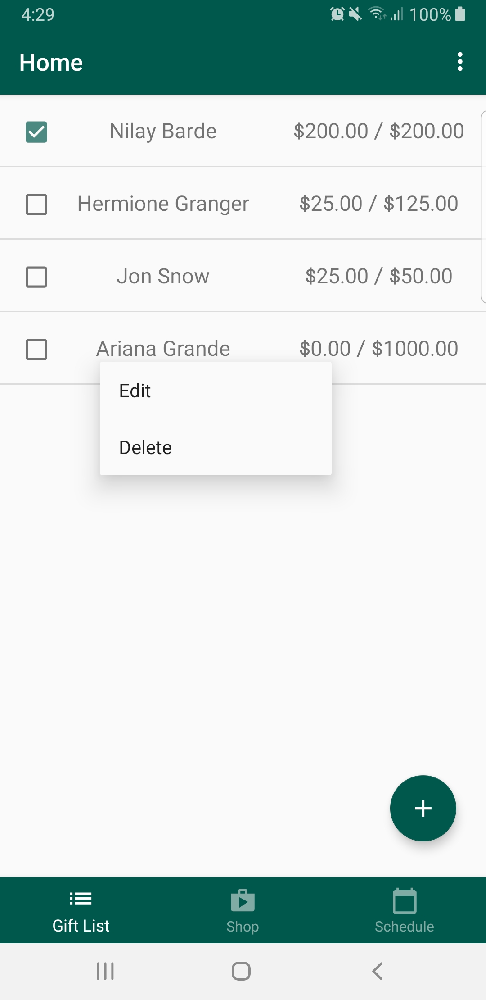
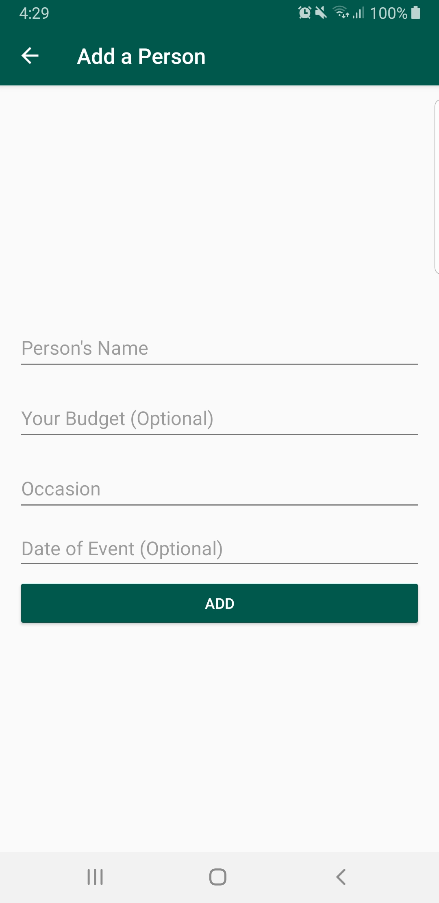
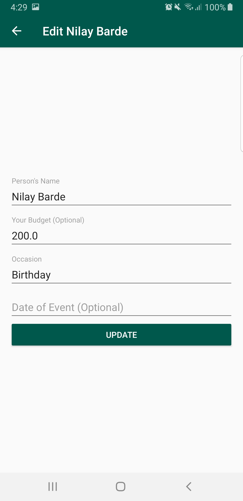

# Giftive

    
    
    
    
  

## Description

Giftive is an android application that lets users add people, budgets, and gifts in order to organize the gifting process.

## Features
Have the ability to log in through a Google account, Facebook account, email address, or a phone number. Data will be stored based on login and can be accessed from multiple devices.

Scrolling list of all the people that the user has added to their gift list

Can edit and delete people in this scrolling gift list

Checkbox next to person names will become checked when the user has checked off all the items to be bought

Expandable list to show all the gifts the user has added for each person

Can check off gifts in the expandable list when user has bought the item to keep track

Calendar view to show the upcoming dates for when the user needs to buy the 

## Acknowledgment
Usage of a compact calendar made by SundeepK.
https://github.com/SundeepK/CompactCalendarView

App Icon and logo made with https://www.freelogodesign.org

## Addtional Screenshots

    
    
    
    
    
  

